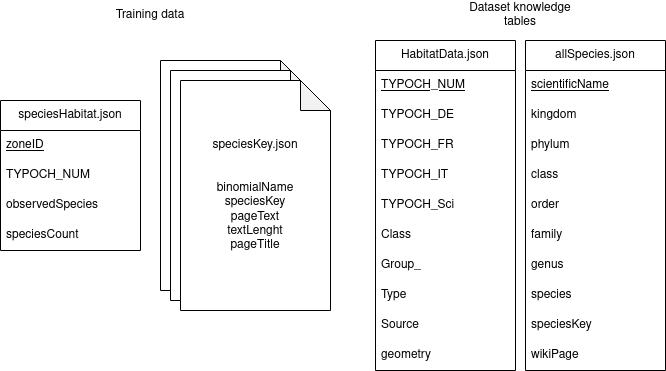

# WikiSpeciesHabitats dataset
This repository containts the scripts to create the WikiSpeciesHabitats dataset. 
This dataset contains habitats and species occurence pairs, with textual descriptions of the species which are their wikipedia page text. 
Its range is limited to Switzerland because of the coverage of habitat maps.


It is obtained by merging information from three initial sources :
1. [The Habitat Map of Switzerland v1](https://www.envidat.ch/dataset/habitat-map-of-switzerland)
2. [Global Biodiversity Information Facility occurence data](https://www.gbif.org/en/occurrence/search?occurrence_status=present&q=)
3. [Wikipedia dump](https://en.wikipedia.org/wiki/Wikipedia:Database_download)


---

## Dataset building

### 1 Packages and setup

First, install the required packages in your environments by running

```Bash
pip install -r requirements.txt
```
Then create the following directories : ./raw_data, ./raw_data/studyArea, ./processed_data, ./WikiSpeciesHabitats/, ./WikiSpeciesHabitats/species/
### 2 Study Area

1. Define a study area, and save it in the shapefile format with the name studyArea.shp
2. You can also create a .geojson version of the file as it can be used to extract data
3. Save your files in the ./raw_data/studyArea/ directory

### 3 Habitat maps
1. Download the cantonal habitat maps for each canton you are interested in (in this case, only VD and VS have been used)
2. Each download should be named habitatmap_xx_yyyymmdd, with xx being the two letter code for the canton
3. Rename each downloaded folders as habitatmap_xx
4. Place your downloaded folders in ./raw_data/

### 4 Species occurences
1. Select the filters you want (country, administrative area, etc...), and download the occurence data in .csv format. You should choose the "simple" option.
2. rename your download as gbif_raw.csv and place it in the ./raw_data/ directory

### 5 Wikipedia articles
1. Download a Wikipedia dump ([this post](https://towardsdatascience.com/wikipedia-data-science-working-with-the-worlds-largest-encyclopedia-c08efbac5f5c) might help you)
2. Put all the dump files in the ./wikipedia_dump/ directory
3. Make sure that the ./wikipedia_species/ directory exits. If not, create it
4. Run the wikipedia dump parsing script 
```Bash
python parse_wikipedia.py
```
### 6 Merge data sources
At this stage, your working directory (here named WSH) should kind of look like this :
```bash
 WSH
  ├── processed_data/
  ├── raw_data/
  │   ├── habitatmap_vd/
  │   │   ├── HabitatMap_VD.gdb/
  │   │   └── ...
  │   ├── habitatmap_vs/
  │   │   ├── HabitatMap_VS.gdb/
  │   │   └── ...
  │   ├── studyArea/
  │   │   ├── studyArea.shp
  │   │   └── ...
  │   └── gbif_raw.csv
  ├── wikipedia_dump/
  │   └── ....
  ├── WikiSpeciesHabitats/
  │   └── species/
  │       ├── 100124.json
  │       └── ...
  ├── create_dataset.py
  ├── grid.py
  ├── parse_wikipedia.py
  └── requirements.txt
```
Then, you can run the following command to create the dataset

```bash
python create_dataset.py --STEP all
```
You might want to edit the create_dataset.py file to configure which cantons you are using.

---

### Finished dataset
Once all the steps have been executed, the following files should have been created :
1. .json files named in the format specieskey.json with the wikipedia page content for the species. These files are in the WikiSpeciesData/species/ directory
2. WikiSpeciesData/habitatsData.json that contains information for each habitat type
3. WikiSpeciesData/speciesData.son that contains taxonomy and informations for each species
4. WikiSpeciesData/speciesInZones that contain a set of observed species for each zone, as well as the corresponding habitat type
5. A bunch of other files, which are usefull to compute statistics about the dataset, which are in the processed_data/ directory. 

<!--- Overall, the WikiSpeciesHabitats Dataset has the following structure : 

 -->
